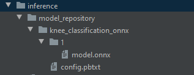

# Knee osteoporosis classifier
### Training
In folder training there is notebook from Kaggle where I trained the model.

### Inference

1. Get [model.onnx](https://drive.google.com/file/d/18oLiOQUbupw9GeNUEGh0SU9_HwPSbNtZ/view?usp=sharing
) from google drive and put it to model_repository.



2. Run NVIDIA Tritor Inference Server with command from inference folder:
```
docker run --rm -p 8000:8000 -p 8001:8001 -p 8002:8002 -v ${PWD}/model_repository:/models nvcr.io/nvidia/tritonserver:25.04-py3 tritonserver --model-repository=/models
```
I do not use gpus for the run, because I do not have any. 

3. Prepare environment to run client application (e.g. with Conda):
```commandline
conda create -n client_app_env python==3.12
conda activate client_app_env
cd inference
pip install -r requirements.txt
```
4. Run client app with path to image you want to classify.
```commandline
python client.py -i "x/N14.jpg"
```